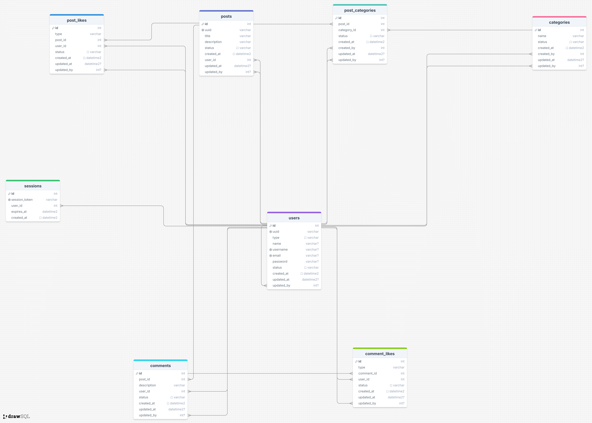

# Forum

## Description

This project is a web-based forum that enables users to communicate, share posts, and interact with others through comments, likes, and dislikes. It supports category-based filtering and user authentication.

## Objectives

The forum allows:

- Communication between users.

- Associating categories with posts.

- Liking and disliking posts and comments.

- Filtering posts based on categories, created posts, and liked posts.

## Features

### SQLite Database

- SQLite is used to store data such as users, posts, comments, and interactions.

- The database should include at least one SELECT, one CREATE, and one INSERT query.

- Database Entity-Relationship Diagram

    Below is the ERD representing the structure of the forum database:

    


### Authentication

- Users can register and log in using email, username, and password.

- Password encryption (Bonus task).

- Users receive an error if an email is already taken.

- Login sessions are handled using cookies with an expiration date.

- Use of UUID for session management (Bonus task).

### Communication

- Only registered users can create posts and comments.

- Posts can be categorized into one or more categories.

- Posts and comments are visible to all users (including non-registered users).

### Likes and Dislikes

- Only registered users can like or dislike posts and comments.

- The number of likes and dislikes is publicly visible.

### Filtering Mechanism

Users can filter posts by:

- Categories

- Created posts (only for logged-in users)

- Liked posts (only for logged-in users)

### Docker Integration

- The project is containerized using Docker.

## Project Structure (MVC & Modular)

```
    Forum/
    ├── server.go
    ├── server_test.go               
    ├── go.mod
    ├── README.md
    ├── modules/
    │   ├── errorMangement/
    │   │   ├── controllers/
    │   │   │    └── errorHandler.go
    │   │   ├── views/
    │   │   │    ├── errors-new.html
    │   │   │    └── errors.html
    │   ├── forumMangement/
    │   │   ├── controllers/
    │   │   │    ├── commentController.go
    │   │   │    ├── postController.go
    │   │   │    └── mainPageController.go
    │   │   ├── models/
    │   │   │    ├── category.go
    │   │   │    ├── comment.go
    │   │   │    ├── commentlike.go
    │   │   │    ├── post.go
    │   │   │    ├── postCategory.go
    │   │   │    └── postLike.go
    │   │   ├── views/
    │   │   │    ├── category_posts.html
    │   │   │    ├── edit_post.html
    │   │   │    ├── forgot_password.html
    │   │   │    ├── index.html
    │   │   │    ├── my_created_posts.html
    │   │   │    ├── my_liked_posts.html
    │   │   │    ├── new_post.html
    │   │   │    ├── post_details.html
    │   │   │    ├── reset_password.html
    │   │   │    ├── search_posts.html 
    │   │   │    ├── top_posts.html 
    │   │   │    ├── user_profile.html 
    │   │   │    └── signin.html
    │   └── userMangement/
    │   │   ├── controllers/
    │   │   │    └── userController.go
    │   │   ├── models/
    │   │   │    ├── session.go
    │   │   │    └── user.go
    │   │   ├── views/
    │   │   │    └── authPage.html
    ├── utils/
    │   ├── formatter.go
    │   ├── urlExtract.go
    │   └── uuid.go
    ├── db/
    │   ├── dbUtils.go
    │   ├── forum.pdf
    │   └── forum.sql
    ├──  assets/
    │   ├── css/
    │   ├── img/
    │   └── js/
    ├── docker-compose.yml
    └── Dockerfile
```

## Setup Instructions
### Requirements

To run this project, you need either:

- Docker

- Go language compiler

1. Clone the repository:

```
    git clone <repository_url>
    cd Forum
```
#### Using Docker

2. Build and run with Docker:
    ```
    docker-compose up --build 
    ```

3. Open the forum in your browser:
    http://localhost:8080/

#### Using Go

2. Install dependencies:
```
    go mod tidy
```

3. Run the server:
```
    go run .
```
4. Open the forum in your browser:
    http://localhost:8080/

---

## Instructions

- Use SQLite for database management.

- Handle website errors and HTTP status codes.

- Implement error management to handle technical issues.

- Follow good coding practices.

- Include test files for unit testing.

---

## Authors

- Parisa Rahimi
- Fatemeh Kheirkhah
- Mohammad mahdi Kheirkhah
---
